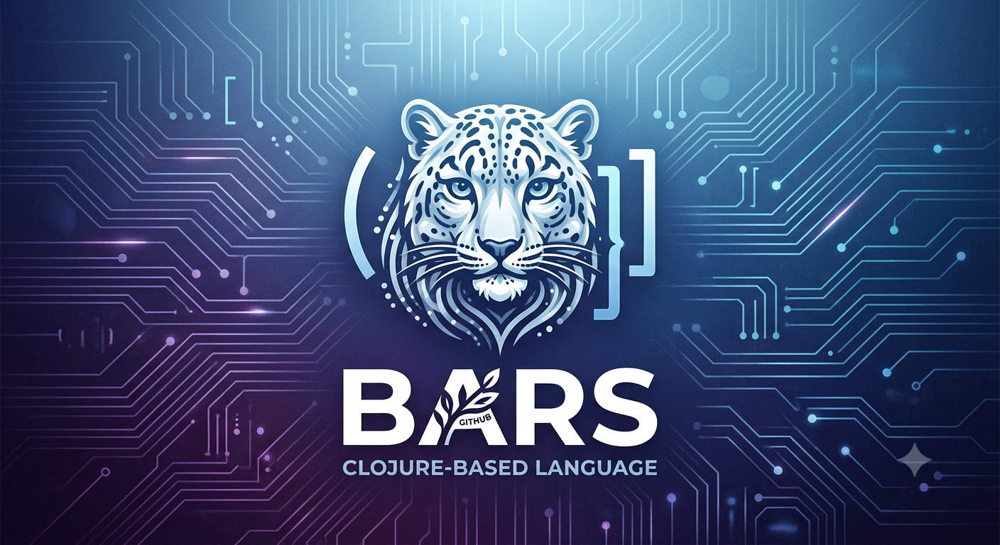

# 🐆 Bars

> **Bars** (барс) — Снежният леопард. Бърз, независим, опасен.



A systems programming language with **Clojure** syntax, **Rust**-like ownership (lighter), and compilation to native code via **QBE**, **Cranelift**, and **LLVM**.

```clojure
;; examples/hello.brs
(defn main []
  (println "Hello, World!"))
```

```bash
$ bars run examples/hello.brs
Hello, World!
```

---

## Why Bars?

- **Clojure syntax** — parentheses naturally express scope and structure.
- **Lightweight ownership** — NLL borrow checking, drop checking, no lifetime annotations.
- **Type inference** — Hindley-Milner type system with `bars check --types`.
- **Three backends** — QBE for fast AOT, Cranelift for JIT/REPL, LLVM for `--release`.
- **Lambda functions** — anonymous `(fn [x] body)` with full pipeline support.
- **Zero-cost FFI** — direct C ABI access through the runtime.
- **GC when you want it** — stack + ownership + Boehm GC for complex data.
- **`.brs`** — source file extension.

---

## Quick Start

### Prerequisites

- Rust 1.70+ (for building the compiler)
- `qbe` (AOT backend, installed at `~/.local/bin/qbe` or on PATH)
- `libgc-dev` (Boehm GC for the runtime)
- `cc` / `gcc` (for linking)

### Build

```bash
git clone https://codeberg.org/bars-lang/bars-lang.git
cd bars-lang
cargo build --release
```

### Run

```bash
# Read and print AST
bars read examples/hello.brs

# Compile to QBE IR
bars build examples/hello.brs

# Compile and run
bars run examples/math.brs

# REPL (Cranelift JIT)
bars repl
```

---

## Language Tour

### Functions

```clojure
(defn greet [name]
  (println name))

(defn add [a b]
  (+ a b))
```

### Variables

```clojure
(defn main []
  (let [x 42
        y (+ x 1)]
    (println y)))
```

### Conditionals

```clojure
(defn main []
  (let [x 2]
    (cond
      (= x 1) "one"
      (= x 2) "two"
      :else   "other")))
```

### Loops

```clojure
(defn factorial [n]
  (loop [i n acc 1]
    (if (= i 0)
      acc
      (recur (- i 1) (* acc i)))))
```

### Vectors

```clojure
(defn main []
  (let [v (vector 1 2 3)]
    (push v 4)
    (println (count v))        ;; 4
    (println (get v 2))))      ;; 3
```

### Maps

```clojure
(defn main []
  (let [m (map)]
    (map-set m 1 100)
    (println (map-get m 1))))  ;; 100
```

### Borrowing (Ownership)

```clojure
(defn use-buf [^buf data]
  ;; immutable borrow
  (println (count data)))

(defn mutate-buf [^mut buf data]
  ;; mutable borrow
  (push data 42))
```

### Loading Libraries

```clojure
(load "lib/core.brs")
(load "lib/math.brs")

(defn main []
  (println (factorial 5))
  (println (range 1 10)))
```

### Lambda Functions

```clojure
;; Inline anonymous functions
(fn [x] (+ x 1))

;; Lambda with borrow annotation
(fn [^buf data]
  (println (count data)))

;; Lambda as function body
(defn make-adder [n]
  (fn [x] (+ x n)))
```

### Type Checking

```bash
$ bars check --types examples/hello.brs
✅ Type inference passed.
  main : i64
```

---

## CLI Reference

| Command | Description |
|---------|-------------|
| `bars read <file>` | Parse and print AST |
| `bars build <file>` | Compile to QBE IR via HIR (stdout) |
| `bars build --backend llvm <file>` | Compile via LLVM to object file |
| `bars build --release <file>` | Release build with optimizations |
| `bars run <file>` | Compile, link, and execute (QBE) |
| `bars run --backend llvm <file>` | Compile, link, and execute (LLVM) |
| `bars repl` | Interactive Cranelift JIT session |
| `bars check <file>` | Run ownership analysis |
| `bars check --types <file>` | Run type inference |
| `bars build --features llvm-backend` | Enable LLVM backend (requires LLVM 14+) |

---

## Project Structure

```
.
├── src/              # Compiler source (Rust)
│   ├── reader/       # Lexer + Parser
│   ├── ast/          # AST types
│   ├── macro/        # Macro expansion
│   ├── ownership/    # Ownership checker
│   ├── types/        # Hindley-Milner type inference
│   ├── hir/          # High-level IR (flattened)
│   └── backends/     # QBE + Cranelift + LLVM backends
├── runtime/          # C runtime + Boehm GC
├── lib/              # Standard library (.brs)
├── examples/         # Example programs
├── tests/            # Integration tests
└── docs/             # Documentation
```

---

## Backends

| Backend | Mode | Status |
|---------|------|--------|
| **QBE HIR** | Fast AOT debug/release | ✅ Working |
| **Cranelift** | JIT / REPL | ✅ Working |
| **LLVM** | Optimized release (--release) | ✅ Working |

---

## Standard Library

See [`lib/`](lib/) and [`docs/04-stdlib.md`](docs/04-stdlib.md).

- `lib/core.brs` — numeric helpers, vector helpers, range, `or`, `and`
- `lib/math.brs` — `square`, `cube`, `gcd`, `lcm`, `factorial`, `fib`, `sum`, `product`
- `lib/vector.brs` — `last`, `rest`, `take`, `drop`, `reverse`, `contains?`, `index-of`
- `lib/string.brs` — `str-empty?`, `str-count`
- `lib/map.brs` — `map-empty?`, `map-has?`

---

## Architecture

```
.brs → Reader → AST → Macro Expansion → Ownership Check → HIR → Backend → Native Code
                                                                    ├── QBE IR → qbe → cc
                                                                    ├── Cranelift → JIT
                                                                    └── LLVM IR → llc → cc
```

---

## Development Status

See [ROADMAP.md](ROADMAP.md) for the full plan.

| Feature | Status |
|---------|--------|
| Reader (Lexer + Parser) | ✅ |
| AST → HIR → QBE IR | ✅ |
| Functions & recursion | ✅ |
| Ownership checker | ✅ |
| Runtime + Boehm GC | ✅ |
| REPL + Cranelift JIT | ✅ |
| Built-in macros (`when`, `unless`, `cond`, `->`, `->>`) | ✅ |
| `loop` / `recur` | ✅ |
| `load` system | ✅ |
| Stdlib | ✅ |
| LLVM backend | ✅ |
| User-defined macros (`defmacro`) | ✅ |
| Type inference (`check --types`) | ✅ |
| Lambda functions (`fn [x] body`) | ✅ |

---

## License

MIT or Apache-2.0
