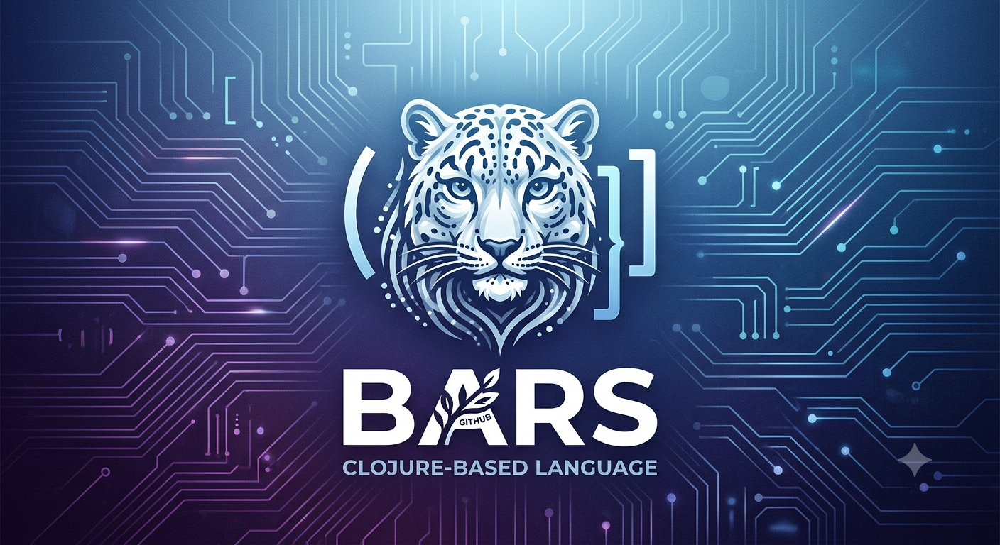

# 🐆 Bars

> **Bars** (барс) — Снежният леопард. Бърз, независим, опасен. The snow leopard (*Panthera uncia*). 



A systems programming language with **Clojure** syntax, **Rust**-like ownership (lighter), and compilation to native code via **Cranelift** and **LLVM**.

```clojure
;; examples/hello.brs
(defn main []
  (println "Hello, World!"))
```

```bash
$ bars run examples/hello.brs
Hello, World!
```

---

## Why Bars?

- **Clojure syntax** — parentheses naturally express scope and structure. Only `()` and `[]` brackets.
- **Lightweight ownership** — NLL borrow checking, drop checking, no lifetime annotations.
- **Type inference** — Hindley-Milner type system with `bars check --types`.
- **Two backends** — Cranelift for JIT/REPL and fast AOT, LLVM for `--release`.
- **Lambda functions** — anonymous `(fn [x] body)` with full pipeline support.
- **Zero-cost FFI** — direct C ABI access through the runtime.
- **GC when you want it** — stack + ownership + Boehm GC for complex data.
- **`.brs`** — source file extension.

---

## Quick Start

### Prerequisites

- Rust 1.70+ (bootstrap host only — like Nim `csources`)
- `libgc-dev` (Boehm GC for the runtime)
- `clang` / `cc` (link self-hosted LLVM output)
- `make`

### Build

```bash
git clone https://codeberg.org/bars-lang/bars-lang.git
cd bars-lang

# Host bootstrap (Rust) + C runtime + self-hosted compiler
make host
make runtime
make bars-self          # → ./bars-self  (Gen1, written in Bars)

make self-test          # example suite via ./bars-self
make identity           # Gen3/Gen4 LLVM IR fixed point
```

Language development is **Bars-first** in `compiler/*.brs`.  
The Rust tree under `bootstrap/` is frozen for bring-up only — see `bootstrap/FROZEN.md`.

### Run

```bash
# Self-hosted compiler: .brs → native binary
./bars-self examples/math.brs /tmp/math && /tmp/math

# Host (Rust) — REPL / typecheck / alternative backends
./target/release/bars run examples/math.brs
./target/release/bars repl
```

### Editor (VS Code + LSP)

```bash
make host
cd editors/vscode && npm install
code --install-extension .
```

Set `bars.lsp.path` to `…/target/release/bars` if `bars` is not on `PATH`.  
Features: syntax, diagnostics, hover types, completion, go-to-definition.  
Details: [`editors/vscode/README.md`](editors/vscode/README.md) · CLI: `bars lsp`.

---

## Language Tour

### Functions

```clojure
(defn greet [name]
  (println name))

(defn add [a b]
  (+ a b))
```

### Variables

```clojure
(defn main []
  (let [x 42
        y (+ x 1)]
    (println y)))
```

### Conditionals

```clojure
(defn main []
  (let [x 2]
    (cond
      (= x 1) "one"
      (= x 2) "two"
      :else   "other")))
```

### Loops

```clojure
(defn factorial [n]
  (loop [i n acc 1]
    (if (= i 0)
      acc
      (recur (- i 1) (* acc i)))))
```

### Vectors

```clojure
(defn main []
  (let [v (vector 1 2 3)]
    (push v 4)
    (println (count v))        ;; 4
    (println (get v 2))))      ;; 3
```

Vectors can be nested:

```clojure
(def v [1 [2 3] 4])
(println (get (get v 1) 0))  ;; 2
```

### Maps

Maps are created with functions (no `{}` literal syntax):

```clojure
(defn main []
  (let [m (map)]
    (map-set m 1 100)
    (println (map-get m 1))))  ;; 100
```

Maps can hold vectors as values:

```clojure
(def m (map))
(map-set m 1 [10 20])
(println (get (map-get m 1) 0))  ;; 10
```

### Sets

```clojure
(defn main []
  (let [s (set)]
    (set-add s 1)
    (set-add s 2)
    (println (set-count s))          ;; 2
    (println (set-contains? s 2))))  ;; 1 (true)
```

### Borrowing (Ownership)

```clojure
(defn use-buf [^buf data]
  ;; immutable borrow
  (println (count data)))

(defn mutate-buf [^mut buf data]
  ;; mutable borrow
  (push data 42))

;; Implicit borrow: ^ is optional when passing owned values
(let [v (vector 1 2 3)]
  (use-buf v)           ;; automatic borrow
  (use-buf v))          ;; OK — borrow released after each call
```

### Loading Libraries

```clojure
(load "lib/core.brs")
(load "lib/math.brs")

(defn main []
  (println (factorial 5))
  (println (range 1 10)))
```

### Lambda Functions

```clojure
;; Inline anonymous functions
(fn [x] (+ x 1))

;; Lambda with borrow annotation
(fn [^buf data]
  (println (count data)))

;; Lambda as function body
(defn make-adder [n]
  (fn [x] (+ x n)))
```

### Type Checking

```bash
$ bars check --types examples/hello.brs
✅ Type inference passed.
  main : i64
```

### Algebraic Data Types

```clojure
(deftype Option [Some i64] [None])
(deftype Result [Ok i64] [Err i64])

(defn handle [res]
  (match res
    (Ok v) (+ v 1)
    (Err e) (* e -1)))
```

Конструкторите се разпознават по главна буква. `match` проверява за exhaustiveness.

### FFI — Foreign Function Interface

```clojure
;; Деклариране на C функция
(extern "putchar" [c i64] -> i64)

(defn main []
  (putchar 65))  ;; отпечатва 'A'
```

Работи с Cranelift и LLVM — генерира правилни extern declarations.

---

## CLI Reference

| Command | Description |
|---------|-------------|
| `bars read <file>` | Parse and print AST |
| `bars build <file>` | Compile to binary via HIR |
| `bars build --backend cranelift <file>` | Compile via Cranelift |
| `bars build --backend llvm <file>` | Compile via LLVM |
| `bars build --release <file>` | Release build with optimizations |
| `bars run <file>` | Compile, link, and execute (default Cranelift) |
| `bars run --backend cranelift <file>` | Compile, link, and execute (Cranelift) |
| `bars run --backend llvm <file>` | Compile, link, and execute (LLVM) |
| `bars repl` | Interactive Cranelift JIT session |
| `bars check <file>` | Run ownership analysis |
| `bars check --types <file>` | Run type inference |
| `bars build --features llvm-backend` | Enable LLVM backend (requires LLVM 14+) |

---

## Project Structure

```
.
├── bootstrap/        # Rust bootstrap compiler
│   ├── src/           # Compiler source (Rust)
│   ├── reader/       # Lexer + Parser
│   ├── ast/          # AST types
│   ├── macro/        # Macro expansion
│   ├── ownership/    # Ownership checker
│   ├── types/        # Hindley-Milner type inference
│   ├── hir/          # High-level IR (flattened)
│   └── backends/     # Cranelift + LLVM backends
├── compiler/         # Self-hosted compiler (Bars)
│   ├── reader.brs    # Lexer + Parser
│   ├── hir.brs       # AST → HIR lowering
│   ├── types.brs     # Type inference
│   ├── ownership.brs # Ownership checker
│   ├── build.brs     # Build pipeline
│   └── codegen/      # LLVM backend
├── runtime/          # C runtime + Boehm GC
├── lib/              # Standard library (.brs)
├── examples/         # Example programs
├── tests/            # Integration tests
└── docs/             # Documentation
```

---

## Backends

| Backend | Mode | Status |
|---------|------|--------|
| **Cranelift** | JIT / REPL / AOT | ✅ Working |
| **LLVM** | Optimized release (--release) | ✅ Working |

---

## Standard Library

See [`lib/`](lib/) and [`docs/04-stdlib.md`](docs/04-stdlib.md).

- `lib/core.brs` — numeric helpers, sequence ops, HOF-friendly helpers
- `lib/math.brs` — `square`, `cube`, `gcd`, `lcm`, `factorial`, `fib`, …
- `lib/vector.brs` / `lib/map.brs` / `lib/string.brs` — collection helpers
- `lib/test.brs` — `suite` / `is` / `is-eq` / `deftest` / `finish`
- `lib/net.brs` · `lib/http.brs` · `lib/http_server.brs` — TCP + HTTP/1.1
- `lib/tls.brs` · `lib/https.brs` — OpenSSL client (opt-in link)
- `lib/json.brs` · `lib/regex.brs` · `lib/io.brs` · `lib/crypto.brs` (`sha256`)
- `lib/kw.brs` · `lib/persist.brs` · `lib/async.brs` · `lib/args.brs`

Built-ins also include `map`/`filter`/`reduce`, `sort`/`sort-by`, `get-in`/`assoc-in`,
string ops (`str-concat`, `str-replace`, `str-upper`, …), and more — see the stdlib doc.

---

## Architecture

```
.brs → Reader → Modules → Macros → Types → Ownership → HIR → Backend → Binary
                                                         ├── LLVM IR → clang  (bars-self default)
                                                         ├── C → cc
                                                         └── WASM / host Cranelift
```

Self-host lives in `compiler/`; Rust host in `bootstrap/` (LSP, REPL, Gen1 seed).

---

## Development Status

See [ROADMAP.md](ROADMAP.md) / [PLAN.md](PLAN.md). Phases **0–17** are complete
(self-host, stdlib seq/HOF, TLS/HTTPS, host Gen1 bootstrap restore).

| Feature | Status |
|---------|--------|
| Self-hosted compiler (`bars-self`, Gen1→Gen3 identity) | ✅ |
| LLVM / C / WASM backends | ✅ |
| Ownership + HM type inference | ✅ |
| Closures, apply, HOF desugar, auto TCO | ✅ |
| User `defmacro` + expand-time interpreter | ✅ |
| Sequence / map API (Clojure-style) | ✅ |
| TCP, HTTP, HTTPS (OpenSSL client) | ✅ |
| Package path/git/registry | ✅ |
| Test framework (`lib/test`) | ✅ |
| LSP (`bars lsp`) + VS Code extension | ✅ |
| REPL (host Cranelift) | ✅ |

---

## License

MIT or Apache-2.0
